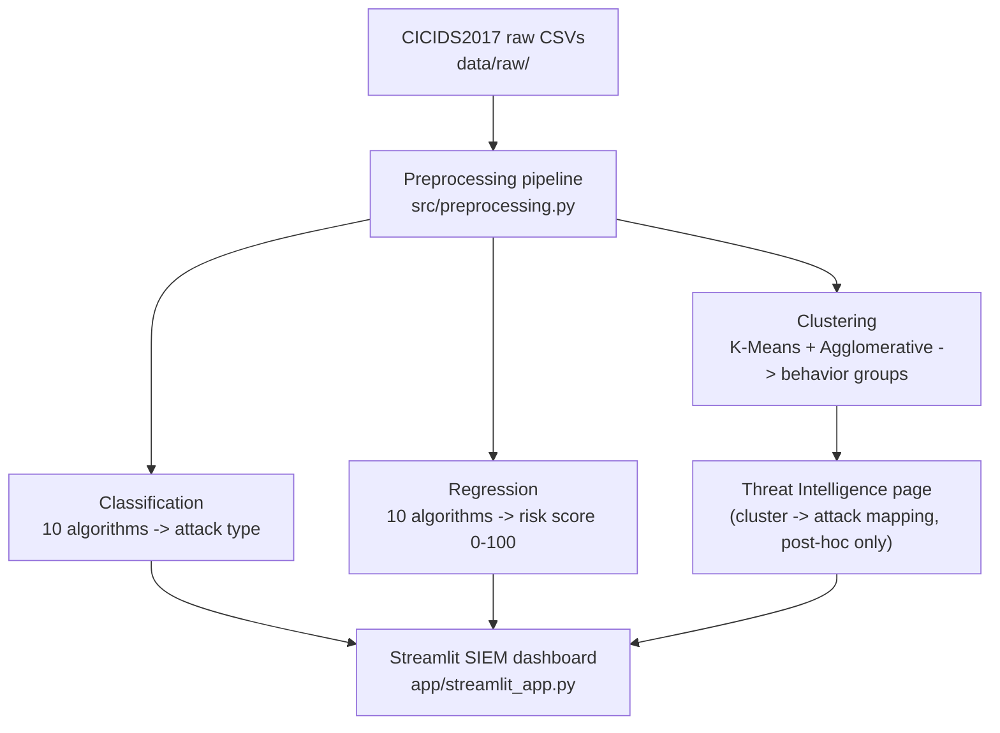

# CyberThreat-ML: AI-Powered Cyber Threat Intelligence and Intrusion Detection System

A machine learning capstone project that analyzes network traffic (CICIDS2017), detects and classifies attacks, generates a behavior-based cybersecurity risk score, and discovers hidden attack patterns through clustering -- wrapped in a SOC-style Streamlit dashboard.

## Table of contents

- [Overview](#overview)
- [Problem statement](#problem-statement)
- [Architecture](#architecture)
- [Dataset](#dataset)
- [Installation](#installation)
- [Usage](#usage)
- [ML pipeline](#ml-pipeline)
- [Results](#results)
- [Screenshots](#screenshots)
- [Project structure](#project-structure)
- [Known limitations](#known-limitations)
- [Future improvements](#future-improvements)
- [Resume / portfolio summary](#resume--portfolio-summary)

## Overview

This project builds a realistic, three-track intrusion detection system rather than a single generic classifier:

| Track | Question it answers | Techniques |
|---|---|---|
| **Classification** | What type of attack is this? | 10 algorithms, tuned, compared, explained |
| **Regression** | How risky is this traffic, on a 0-100 scale? | A behavior-derived score (not a label lookup), 10 regression algorithms |
| **Clustering** | What attack behaviors exist that we haven't labeled? | K-Means + Agglomerative, discovered without using labels |

All three tracks share one preprocessing pipeline (`src/preprocessing.py`), and the results are served through a Streamlit dashboard styled after enterprise SIEM tools (Splunk / Elastic Security / Sentinel).

## Problem statement

Signature-based intrusion detection struggles against novel or evolving attack patterns. This project explores whether flow-level behavioral features (packet rates, byte rates, TCP flag patterns, flow duration, forward/backward traffic asymmetry) can support three complementary defensive capabilities: identifying known attack types, quantifying risk on a continuous scale for triage, and surfacing behavioral clusters that a human analyst can investigate even before they're formally labeled.

## Architecture



Preprocessing runs once and feeds all three tracks, so cleaning logic exists in exactly one place. Classification and regression are supervised and surface live in the app. Clustering stays fully unsupervised through training -- its output is a behavioral report checked against real labels only after fitting, never during.

## Dataset

**CICIDS2017**, created by the Canadian Institute for Cybersecurity (University of New Brunswick): ~2.8 million labeled network flows captured over 5 days, with attack categories including DDoS, DoS, PortScan, Bot, Brute Force, Web Attack, Infiltration, and Heartbleed, alongside BENIGN traffic.

- Official source: https://www.unb.ca/cic/datasets/ids-2017.html
- This project uses the pre-extracted flow-feature CSVs (`MachineLearningCSV.zip`, ~78 features per flow via CICFlowMeter), not raw packet captures.
- **Not included in this repository** (several GB, and redistribution isn't this project's to grant) -- download it yourself and place the CSVs in `data/raw/`.
- If citing this dataset in a report, cite the original creators (see the dataset page above for the current citation format).

Known dataset quirks this project explicitly handles (see `01_EDA.ipynb` and `src/preprocessing.py`):
- Severe class imbalance (BENIGN is the large majority; Heartbleed has only a handful of rows)
- `Infinity` values in `Flow Bytes/s` / `Flow Packets/s` from division-by-zero on very short flows
- Inconsistent column naming across day-files (leading spaces, punctuation)
- Some documented labeling/capture inconsistencies reported in later academic re-examinations of the dataset

## Installation

```bash
git clone <your-repo-url>
cd ML_PROJECT
python -m venv venv
source venv/bin/activate        # Windows: venv\Scripts\activate
pip install -r requirements.txt
```

Tested against Python 3.12. If a package fails to build on your platform, upgrading `pip` first (`pip install --upgrade pip`) resolves most issues.

## Usage

1. **Get the dataset.** Download `MachineLearningCSV.zip` from the official CICIDS2017 page and extract the 8 CSV files into `data/raw/`.
2. **Run the notebooks in order** (each one depends on the previous one's saved output):
   ```bash
   jupyter notebook notebooks/01_EDA.ipynb            # cleans data -> data/processed/cleaned_dataset.csv
   jupyter notebook notebooks/02_Classification.ipynb  # -> models/classification/
   jupyter notebook notebooks/03_Regression.ipynb      # -> models/regression/
   jupyter notebook notebooks/04_Clustering.ipynb      # -> models/clustering/
   ```
   Run each notebook top to bottom (Cell -> Run All). Every notebook prints what it's doing and why as it goes.
3. **Launch the dashboard:**
   ```bash
   streamlit run app/streamlit_app.py
   ```
   Each dashboard page reads whichever notebooks have been run so far and shows a clear "run this notebook first" message for any that haven't.

### Hardware notes

Every notebook works on a full dataset scale (millions of rows) by first taking a stratified working sample (rare attack classes are always kept in full; only the dominant classes are capped) -- tuned by default for a mid-range laptop (the project was developed against a Ryzen 7 8845HS / RTX 4050 6GB / 32GB RAM machine). If your machine is more or less powerful, adjust the `WORKING_SAMPLE_SIZE` / `SVM_SAMPLE_SIZE` / `SVR_SAMPLE_SIZE` constants near the top of each notebook. The GPU is not required -- this project deliberately uses scikit-learn (CPU) throughout rather than GPU-dependent frameworks.

## ML pipeline

**Preprocessing** (`src/preprocessing.py`): load & merge day-files -> standardize column names -> handle Infinity/NaN/duplicates (each step reports counts, never silently drops data) -> stratified sampling for compute feasibility -> encode/split/scale with a strict train-only-fit discipline throughout.

**Classification** (`02_Classification.ipynb`): Logistic Regression, KNN, Gaussian Naive Bayes, Decision Tree, SVM, Random Forest, AdaBoost, Gradient Boosting, Bagging, MLP -- compared on accuracy, precision/recall/F1 (weighted and macro), and one-vs-rest ROC-AUC. Random Forest, SVM, and MLP are tuned with `RandomizedSearchCV`. SMOTE is applied to the strongest candidate as a focused imbalance-handling comparison. The final model, scaler, encoder, and feature list are saved for the app.

**Regression** (`03_Regression.ipynb`): the target is a behavior-derived 0-100 risk score (`src/risk_score.py`) built from packet rate, byte rate, TCP flag anomalies, flow duration extremity, and traffic asymmetry -- percentile-normalized and weighted, never a label lookup. Ten regression algorithms are compared (including Polynomial Regression on the 5 risk indicators specifically, to keep the expansion tractable), with 5-fold cross-validation on the top 2.

**Clustering** (`04_Clustering.ipynb`): K-Means (elbow + silhouette-selected k) and Agglomerative clustering (dendrogram, linkage comparison with a safeguard against degenerate splits), evaluated with Silhouette / Davies-Bouldin / Calinski-Harabasz, visualized via PCA (mandatory) and t-SNE (supplementary). Labels are used only afterward, to describe what each cluster represents.

**Explainability**: global feature importance for tree-based models, plus SHAP (`TreeExplainer`) where the winning model supports it efficiently.

## Results

*(This section is intentionally left as a template. Fill it in with your own numbers after running the notebooks against the real dataset -- do not present the illustrative structure below as actual results.)*

**Classification -- top models by weighted F1:**

| Rank | Model | Accuracy | F1 (weighted) | F1 (macro) | ROC-AUC (OvR) |
|---|---|---|---|---|---|
| 1 | *fill in* | | | | |
| 2 | *fill in* | | | | |
| 3 | *fill in* | | | | |

**Regression -- top models by R2:**

| Rank | Model | R2 | RMSE | MAE |
|---|---|---|---|---|
| 1 | *fill in* | | | |
| 2 | *fill in* | | | |

**Clustering:** optimal k = *fill in*, best linkage = *fill in*, silhouette = *fill in*.

## Screenshots

*(Add screenshots of the running dashboard here once you have real data flowing through it -- e.g. `reports/figures/dashboard_overview.png`, `reports/figures/detection_page.png`.)*

## Project structure

```
ML_PROJECT/
├── data/
│   ├── raw/                  # place the CICIDS2017 CSVs here (not committed to git)
│   └── processed/            # cleaned_dataset.csv, generated by 01_EDA.ipynb
├── notebooks/
│   ├── 01_EDA.ipynb
│   ├── 02_Classification.ipynb
│   ├── 03_Regression.ipynb
│   └── 04_Clustering.ipynb
├── src/
│   ├── preprocessing.py      # shared load/clean/encode/scale/sample functions
│   ├── risk_score.py         # behavior-based risk score calculator
│   └── utils.py              # shared evaluation + plotting helpers
├── models/                   # saved models per track (not committed to git)
│   ├── classification/
│   ├── regression/
│   └── clustering/
├── app/
│   └── streamlit_app.py      # SIEM-style dashboard
├── reports/figures/          # generated plots land here
├── requirements.txt
└── .gitignore
```

## Known limitations

- **Sampling.** All three modeling notebooks train on a stratified sample rather than the full ~2.8M rows, for laptop-scale feasibility. Rare classes are always kept in full.
- **SVM/SVR use an even smaller sub-sample** than the other algorithms, since their training cost scales worse than linearly with row count.
- **`destination_port` is a known potential shortcut feature** -- a model can learn "port 21/22 -> Brute Force" without learning real traffic behavior. Consider retraining the winning classifier without it and comparing, as a robustness check.
- **The risk score is a designed metric, not ground truth.** It's validated by checking that it trends higher for known attack types than for BENIGN traffic (see `03_Regression.ipynb`), but it is not itself a labeled quantity, so "accuracy" isn't the right frame for judging it -- R2/RMSE/MAE against its own defined target is.
- **Cluster count and attack-category count won't necessarily match.** Clusters reflect behavioral similarity, which can group multiple attack types together or split one attack type across clusters.

## Future improvements

- Real-time packet capture integration (e.g. via `scapy` or `pyshark`) feeding live flows into the same feature pipeline instead of batch CSV upload.
- Deep learning tracks (LSTM/CNN over raw packet sequences) as a comparison point against the classical ML models here.
- A proper model registry (e.g. MLflow) instead of flat files in `models/`, to track experiments across runs.
- Active-learning loop where analyst feedback on Detection-page predictions retrains the classifier over time.
- Extending the Streamlit app with authentication and a persistent event log (currently every session re-derives its view from `data/processed/`).

## Resume / portfolio summary

Use/adapt these bullet points directly:

- Built an end-to-end, three-track ML system (classification, regression, clustering) for network intrusion detection on CICIDS2017 (~2.8M flows), covering 20+ trained algorithms with hyperparameter tuning (RandomizedSearchCV) and SMOTE-based imbalance handling.
- Designed a behavior-derived cybersecurity risk-scoring model (percentile-normalized composite of packet rate, byte rate, TCP flag anomalies, and traffic asymmetry) rather than a static label-to-score mapping, validated against ground truth without using it as a training signal.
- Applied unsupervised clustering (K-Means, Agglomerative) with PCA/t-SNE visualization to discover attack behavior patterns without using labels during training, including a safeguard against degenerate hierarchical-clustering solutions that raw silhouette score alone can miss.
- Shipped a SOC-style Streamlit dashboard (KPI cards, live detection, model analytics, SHAP-based explainability, cluster-based threat intelligence) consuming the trained pipeline end to end.
- Practiced leakage-safe ML engineering throughout: train-only-fit scalers/encoders/risk-score boundaries, stratified sampling that preserves rare classes, and documented, cited handling of known dataset quality issues (class imbalance, Infinity values, labeling inconsistencies) from the CICIDS2017 literature.
